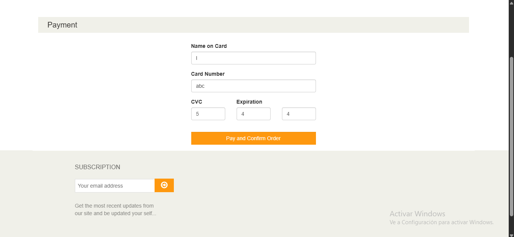
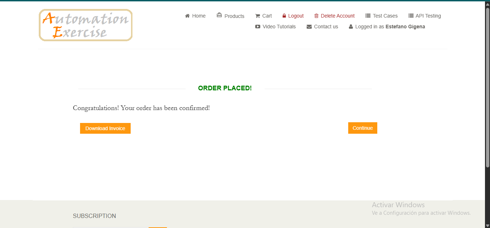

# Bug Reports — AutomationExercise

## BUG-001: Payment form accepts invalid card data and completes the order

| Field | Value |
|-------|-------|
| **Severity** | Critical |
| **Priority** | High |
| **Browser** | Chromium |
| **OS** | Windows |
| **URL** | https://www.automationexercise.com/payment |
| **Status** | Open |

### Steps to Reproduce
1. Navigate to https://www.automationexercise.com/login
2. Log in with valid credentials
3. Go to products section
4. Add any product to the cart
5. Go to cart
6. Proceed to checkout
7. Place the order
8. Enter invalid data in the payment form, e.g. card number "abc",
   CVC "5", expiry "4/4"
9. Confirm the order

### Expected Result
The form should reject invalid card data (show a validation error) and the order should NOT be placed

### Actual Result
The payment form accepts invalid card data and proceeds to the next step, where the order is placed and confirmed

### Evidence

